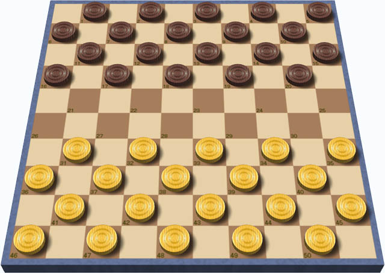

# Draughts. Requisitos Básica
Universo Santa Tecla  
[uSantaTecla@gmail.com](mailto:uSantaTecla@gmail.com)

**Índice**

1. [Requisitos](#requisitos)
2. [Vista de Casos de Uso](#vista-de-casos-de-uso)  
   2.1. [Vista de Caso de Uso Start](#vista-de-caso-de-uso-start)  
   2.2. [Vista de Caso de Uso Move Piece](#vista-de-caso-de-uso-move-piece)  
   2.3. [Vista de Caso de Uso Resume](#vista-de-caso-de-uso-resume)   
   2.4. [Prototipo de Interfaz](#prototipo-de-interfaz)  

## Requisitos

| [Wiki](https://en.wikipedia.org/wiki/Mastermind_(board_game)) - [Youtube](https://www.youtube.com/watch?v=r-7R2sCW3Ro&ab_channel=wikiHow)<br/> * _Funcionalidad: **Básica**_<br/>  * _Interfaz: **Texto**_<br/>  * _Distribución: **Standalone**_<br/>  * _Persistencia: **No**_<br/> |  | 
| :------- | :------: |  

## Vista de Casos de Uso

| Diagrama de Actores y Casos de Uso | Diagrama de Contexto |
|---|---|
|  |  |  

## Vista de Caso de Uso Start


## Vista de Caso de Uso Move Piece


## Vista de Caso de Uso Resume


### Prototipo de Interfaz

```
     ------- Draughts -------
 |   | b |   | b |   | b |   | b |
 | b |   | b |   | b |   | b |   |
 |   | b |   | b |   | b |   | b |
 |   |   |   |   |   |   |   |   |
 |   |   |   |   |   |   |   |   |
 | w |   | w |   | w |   | w |   |
 |   | w |   | w |   | w |   | w |
 | w |   | w |   | w |   | w |   |
Origin coordinate to move
Row: 6
Column: 1
Target coordinate to move
Row: 5
Column: 2
 |   | b |   | b |   | b |   | b |
 | b |   | b |   | b |   | b |   |
 |   | b |   | b |   | b |   | b |
 |   |   |   |   |   |   |   |   |
 |   | w |   |   |   |   |   |   |
 |   |   | w |   | w |   | w |   |
 |   | w |   | w |   | w |   | w |
 | w |   | w |   | w |   | w |   |
Origin coordinate to move
Row: 3
Column: 2
Target coordinate to move
Row: 4
Column: 3
 |   | b |   | b |   | b |   | b |
 | b |   | b |   | b |   | b |   |
 |   |   |   | b |   | b |   | b |
 |   |   | b |   |   |   |   |   |
 |   | w |   |   |   |   |   |   |
 |   |   | w |   | w |   | w |   |
 |   | w |   | w |   | w |   | w |
 | w |   | w |   | w |   | w |   | 
```

